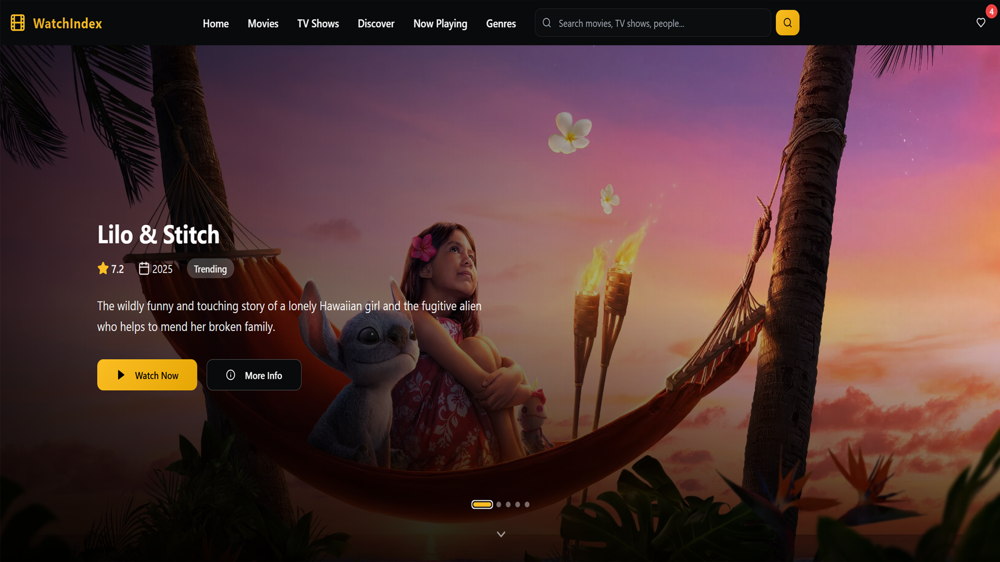

<div align="center">
  
  
  
  
</div>

# 🎬 WatchIndex 

> **Your Ultimate Movie & TV Database** - A modern, responsive web application for discovering movies, TV shows, cast information, and more.

**🌐 Live Demo:** [https://watchindex.vercel.app/](https://watchindex.vercel.app/)
**📂 Repository:** [https://github.com/cjjutba/watch-index](https://github.com/cjjutba/watch-index)

<div align="center">
  <a href="https://watchindex.vercel.app/" target="_blank">
    
  </a>
</div>

---

## ✨ Features

### 🎭 Core Functionality
- **🎬 Movie Discovery**: Browse popular, top-rated, upcoming, and now-playing movies
- **📺 TV Show Exploration**: Discover TV shows with detailed season/episode information
- **🔍 Advanced Search**: Multi-type search with real-time suggestions and filtering
- **👤 Person Profiles**: Detailed cast and crew information with filmographies
- **🎯 Genre Browsing**: Explore content by genres with advanced filtering
- **⭐ Favorites System**: Save and manage favorites with localStorage persistence
- **🎪 Now Playing**: Current theatrical releases with location-based information

### 🎨 User Experience
- **📱 Fully Responsive**: Optimized for desktop, tablet, and mobile devices
- **🌙 Cinema-Inspired Design**: Dark theme with gold accents and premium aesthetics
- **⚡ Fast Performance**: Optimized with React Query caching and lazy loading
- **🎯 Intuitive Navigation**: Clean, professional interface with smooth transitions
- **🔄 Real-time Updates**: Live search suggestions and dynamic content loading
- **🎪 Watch Providers**: Integration with streaming platforms and rental services

---

## 🛠️ Tech Stack

### Frontend & Build Tools
- **⚛️ React 18.3.1** - Modern React with hooks and concurrent features
- **📘 TypeScript 5.5.3** - Full type safety and enhanced developer experience
- **⚡ Vite 5.4.1** - Lightning-fast build tool and development server
- **🎨 Tailwind CSS 3.4.11** - Utility-first CSS framework
- **🧩 shadcn/ui** - High-quality, accessible component library

### State Management & API
- **🔄 TanStack Query 5.56.2** - Powerful data synchronization and caching
- **🌐 Axios 1.10.0** - Promise-based HTTP client for API requests
- **📍 React Router DOM 6.26.2** - Declarative routing for React
- **🎭 TMDB API v3** - Comprehensive movie and TV show database

### UI & Styling
- **� Radix UI** - Unstyled, accessible component primitives
- **� Lucide React** - Beautiful & consistent icon library
- **🎪 Embla Carousel** - Lightweight, extensible carousel library
- **📏 ESLint & TypeScript** - Code quality and type safety

---

## 🚀 Getting Started

### 📋 Prerequisites
- **Node.js 18+** or **Bun** (latest version)
- **TMDB API Key** (free registration at [themoviedb.org](https://www.themoviedb.org/))

### 🔧 Installation

1. **Clone and install**
   ```bash
   git clone https://github.com/cjjutba/watchindex.git
   cd watchindex
   npm install
   ```

2. **Environment setup**
   ```bash
   cp .env.example .env
   ```

3. **Add TMDB API credentials to `.env`**
   ```env
   VITE_TMDB_API_KEY=your_api_key_here
   VITE_TMDB_READ_ACCESS_TOKEN=your_read_access_token_here
   ```

4. **Start development server**
   ```bash
   npm run dev
   ```

5. **Open [http://localhost:8080](http://localhost:8080)**

### 🔑 Getting TMDB API Keys
1. Create a free account at [The Movie Database](https://www.themoviedb.org/)
2. Go to account settings → API
3. Request an API key (choose "Developer" option)
4. Copy both API Key and Read Access Token to your `.env` file

---

## 📁 Project Structure

```
src/
├── components/          # Reusable UI components
│   ├── layout/         # Header, Footer, Navigation
│   ├── movie/          # Movie cards, grids, carousels
│   ├── search/         # Search functionality
│   └── ui/             # shadcn/ui base components
├── hooks/              # Custom React hooks
├── pages/              # Route components
├── services/           # API integration (TMDB)
├── types/              # TypeScript definitions
├── contexts/           # React contexts (Favorites)
└── lib/                # Utilities and helpers
```

---

## � Available Scripts

| Command | Description |
|---------|-------------|
| `npm run dev` | 🚀 Start development server |
| `npm run build` | 🏗️ Build for production |
| `npm run preview` | 👀 Preview production build |
| `npm run lint` | 🔍 Run ESLint |

---

## 🌐 API Integration

**TMDB API v3** integration provides:
- **Movies**: Popular, top-rated, upcoming, now-playing, detailed information
- **TV Shows**: Popular series, seasons, episodes, cast and crew
- **Search**: Multi-type search across movies, TV shows, and people
- **People**: Actor/director profiles, filmographies, external links
- **Genres**: Content discovery and filtering by genre
- **Watch Providers**: Streaming availability by region
- **Images**: High-quality posters, backdrops, and profile photos

---

## ⚡ Performance & Features

### 🚀 Optimizations
- **React Query Caching**: Intelligent data caching and background updates
- **Code Splitting**: Route-based lazy loading for optimal bundle sizes
- **Image Optimization**: Progressive loading with multiple sizes
- **Responsive Design**: Mobile-first approach with optimized breakpoints

### 🎨 Design System
- **Cinema Theme**: Dark background with gold accent colors
- **Typography**: Responsive text scaling and optimal readability
- **Animations**: Smooth 300ms transitions and hover effects
- **Accessibility**: WCAG compliant with proper ARIA labels

---

## 🤝 Contributing

1. Fork the repository
2. Create a feature branch: `git checkout -b feature/amazing-feature`
3. Commit changes: `git commit -m 'Add amazing feature'`
4. Push to branch: `git push origin feature/amazing-feature`
5. Open a Pull Request

---

## 📄 License

This project is licensed under the MIT License - see the [LICENSE](LICENSE) file for details.

---

## 👨‍💻 Author

**CJ Jutba**
- 🌐 **Portfolio**: [https://cjjutba.site/](https://cjjutba.site/)
- � **LinkedIn**: [https://www.linkedin.com/in/cjjutba/](https://www.linkedin.com/in/cjjutba/)
- 🐙 **GitHub**: [https://github.com/cjjutba](https://github.com/cjjutba)
- 📧 **Email**: [cjjutbaofficial@gmail.com](mailto:cjjutbaofficial@gmail.com)

### 🎯 About This Project
WatchIndex is a **portfolio project** showcasing modern React development skills, including advanced TypeScript usage, professional UI/UX design, API integration, responsive design, and performance optimization.

---

<div align="center">
  <h3>🌟 If you found this project helpful, please give it a star! 🌟</h3>

  [](https://github.com/cjjutba/watchindex/stargazers)
  [](https://github.com/cjjutba/watchindex/network/members)

  **Built with ❤️ by CJ Jutba**
</div>

